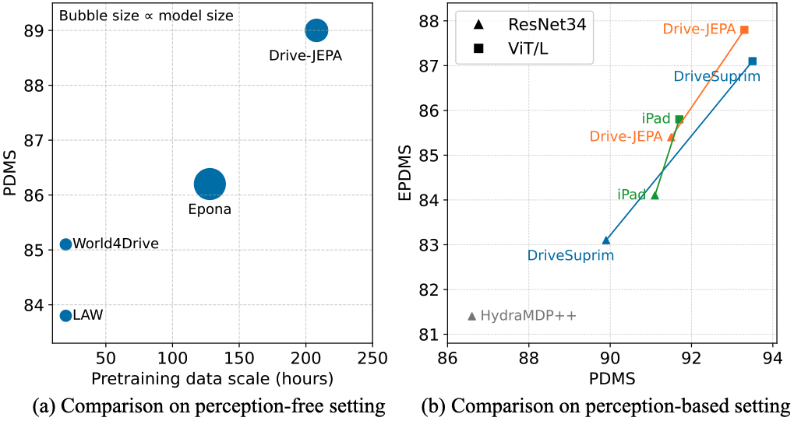
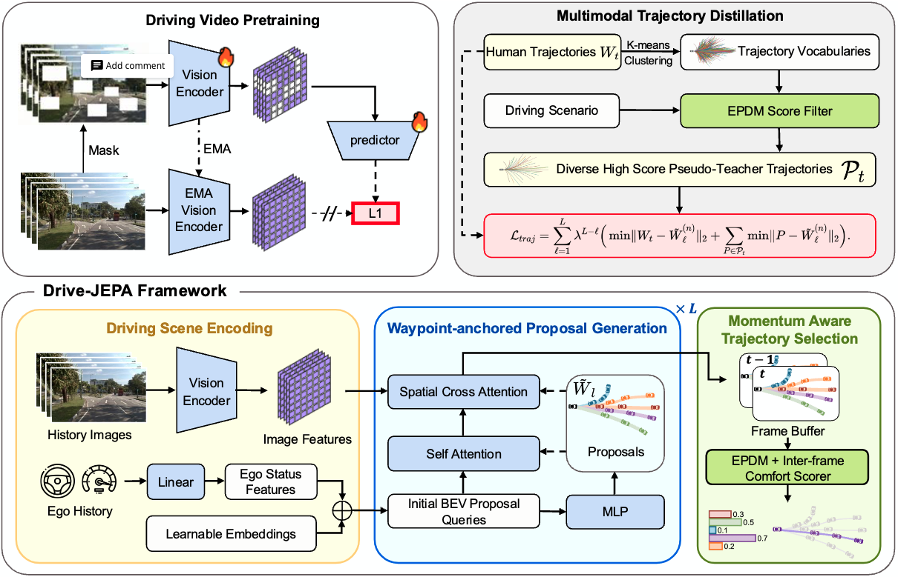
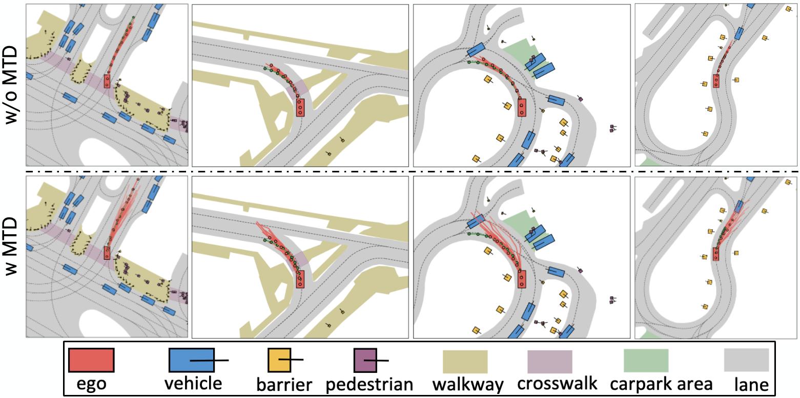

  <h1 align="center">Drive-JEPA: Video JEPA Meets Multimodal Trajectory
Distillation for End-to-End Driving</h1>

[arxiv](https://arxiv.org/abs/2601.22032)

Drive-JEPA outperforms prior methods in both perception-free and perception-based settings.

## 📖 Abstract
End-to-end autonomous driving increasingly leverages self-supervised video pretraining to learn transferable planning representations. However, pretraining video world models for scene understanding has so far brought only limited improvements. This limitation is compounded by the inherent ambiguity of driving: each scene typically provides only a single human trajectory, making it difficult to learn multimodal behaviors. In this work, we propose Drive-JEPA, a framework that integrates Video Joint-Embedding Predictive Architecture (V-JEPA) with multimodal trajectory distillation for end-to-end driving. First, we adapt V-JEPA for end-to-end driving, pretraining a ViT encoder on large-scale driving videos to produce predictive representations aligned with trajectory planning. Second, we introduce a proposal-centric planner that distills diverse simulator-generated trajectories alongside human trajectories, with a momentum-aware selection mechanism to promote stable and safe behavior. When evaluated on NAVSIM, the V-JEPA representation combined with a simple transformer-based decoder outperforms prior methods by 3 PDMS in the perception-free setting. The complete Drive-JEPA framework achieves 93.3 PDMS on v1 and 87.8 EPDMS on v2, setting a new state-of-the-art.

## 🚀 Pipeline

Overview of the Drive-JEPA architecture. Driving Video Pretraining learns a ViT encoder from large-scale driving videos
using the self-supervised V-JEPA objective. Given the pretrained features, Waypoint-anchored Proposal Generation efficiently produces
multiple trajectory proposals, whose distribution is guided by Multimodal Trajectory Distillation. Finally, Momentum-aware Trajectory
Selection picks the final trajectory by accounting for cross-frame comfort.

## 🖼️ Visualization

Bird's eye view of proposals. Without Multimodal Trajectory Distillation (MTD), the proposals collapse into one mode. With
MTD, the proposals show multimodal distribution.

## 🗓️ TODO
- [ ] Release V-JEPA pretraining code
- [ ] Release whole Drive-JEPA code
- [ ] Release checkpoints